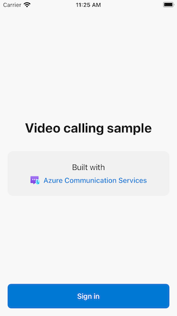
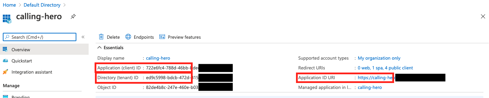

# Group Calling Sample

The sample is a native iOS application that uses the Azure Communication Services iOS client libraries to build a calling experience that features both voice and video calling. The application uses a server-side component to provision access tokens that are then used to initialize the Azure Communication Services client library. To configure this server-side component, feel free to follow the [Trusted Service with Azure Functions](https://docs.microsoft.com/azure/communication-services/tutorials/trusted-service-tutorial) tutorial.

Additional documentation for this sample can be found on [Microsoft Docs](https://docs.microsoft.com/en-us/azure/communication-services/samples/calling-hero-sample?pivots=platform-ios). See this sample's wiki to see updated information on [known issues](https://github.com/Azure-Samples/communication-services-ios-calling-hero/wiki/Known-Issues)


## Features

- Start a new group call
- Join an existing group call
- Join an existing Teams Meeting (For instructions: [Teams Tenant Interoperability](https://docs.microsoft.com/azure/communication-services/concepts/teams-interop))
- Render remote participant video streams
- Turning local video stream from camera on/off
- Mute/unmute local microphone audio



## Prerequisites

- Xcode 13 or greater
- An Azure account with an active subscription. [Create an account for free](https://azure.microsoft.com/free/?WT.mc_id=A261C142F).
- A Mac running [Xcode](https://go.microsoft.com/fwLink/p/?LinkID=266532), along with a valid developer certificate installed into your Keychain. [CocoaPods](https://cocoapods.org/) must also be installed to fetch dependencies.
- A deployed Communication Services resource. [Create a Communication Services resource](https://docs.microsoft.com/azure/communication-services/quickstarts/create-communication-resource).
- An Authentication Endpoint that will return the Azure Communication Services Token. See [example](https://docs.microsoft.com/azure/communication-services/tutorials/trusted-service-tutorial) or clone the [code](https://github.com/Azure-Samples/communication-services-javascript-quickstarts/tree/main/trusted-authentication-service).

## Before running the sample for the first time

1. Run `pod install` on the root of the project directory. This generates `AzureCalling.xcworkspace`
2. Open `AzureCalling.xcworkspace` in XCode.
3. Create a text file called `AppSettings.xcconfig` at the root and add the following values:

```text
communicationTokenFetchUrl = <URL for your Authentication Endpoint, without the https:// component>
```

## Run Sample

1. Build/Run in XCode

## Securing Authentication Endpoint

For simple demonstration purposes, this sample uses a publicly accessible endpoint by default to fetch an Azure Communication Services access token. For production scenarios, it is recommended that the Azure Communication Services access token is returned from a secured endpoint.  
With additional configuration, this sample also supports connecting to an **Azure Active Directory** (AAD) protected endpoint so that user login is required for the app to fetch an Azure Communication Services access token. See steps below:

1. Enable Azure Active Directory authentication in your app.
   - [Register your app under Azure Active Directory (using iOS / macOS platform settings)](https://docs.microsoft.com/azure/active-directory/develop/tutorial-v2-ios)
   - [Configure your App Service or Azure Functions app to use Azure AD login](https://docs.microsoft.com/azure/app-service/configure-authentication-provider-aad)
2. Go to your registered app overview page under Azure Active Directory App Registrations. Take note of the `Application (client) ID`, `Directory (tenant) ID`, `Application ID URI`
   
3. Add the following values to the `AppSettings.xcconfig` file:

   ```text
   communicationTokenFetchUrl = <Application ID URI, without the https://>
   aadClientId = <your Application (client) ID>
   aadTenantId = <your Directory (tenant) ID>
   ```

## Optional Configuration

If you would like to specify a group call UUID or a teams link to join when using the app in your environment, you can add the following parameters to the `AppSettings.xcconfig` file:

```text
displayName = <Your call display name> (optional)
groupCallUuid = <Group call UUID locator> (optional) 
teamsUrl = <teams URL to use, minus the protocol component (optional)>
```

Note that using a teamsUrl will override the group call UUID.

## Additional Reading

- [Azure Communication Calling Features](https://docs.microsoft.com/azure/communication-services/concepts/voice-video-calling/calling-sdk-features) - To learn more about the calling iOS sdk
-[Azure Communication iOS Calling SDK](https://github.com/Azure/Communication/releases/)

## Known Issues

Please refer to the [wiki](https://github.com/Azure-Samples/communication-services-ios-calling-hero/wiki/Known-Issues) for known issues related to this sample.
